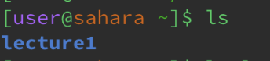
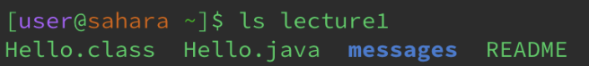
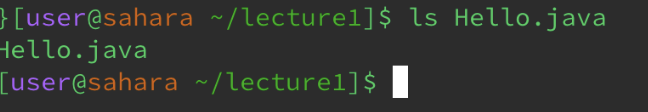
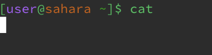
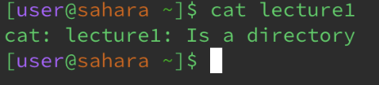
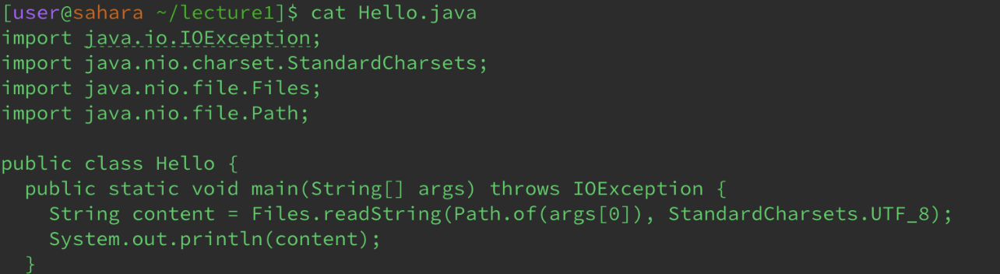

# 1-10-23 #
___
## cd command

The working directory was home.
I got this output because I had no specific working directory as an argument.
This is not an error, the command work as intended.

The working directory here was home until I used to command to go into lecture1.
I got this output because lecture1 is an availiabkle working diretory to use.
Not an error, the command worked.

The working directory was lecture1.
I got this output because cd uses directories, not files.
Not an error, this is supposed to happen with files.
___
## ls command

My working directory was home.
I got this output because the ls command lists everything. At the current directory, lecture1 was the only thing to be listed.
Not an error, the command worked fine

My working directory was still home.
This was my output because the command simply listed everything that was in the directory, lecture1.
No error, the command worked correctly.

Here, my working directory was lecture1.
I received this output because the command list all that was present for that file, meaning not the contents but instead what's availibkle to list.
I did not get an error.
___

## cat command

My working directory was home.
I received this output because I had no arguments.
I didn't get an error.

My working directory was home.
I got this output because lecture1 is a directory and thus, the cat command won't print out the contents of it as it would files.
I didn't get an error.

My working directory was lecture1.
I got this output because Hello.java is a file. cat prints out the contents of files.
I did not got an error

