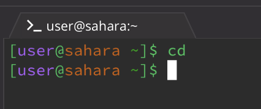
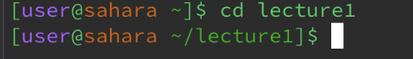
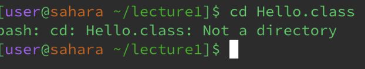

# 1-10-23 #
___
## cd command##

The working directory was home.
I got this output because I had no specific working directory as an argument.
This is not an error, the command work as intended.

The working directory here was home until I used to command to go into lecture1.
I got this output because lecture1 is an availiabkle working diretory to use.
Not an error, the command worked.

The working directory was lecture1.
I got this output because cd uses directories, not files.
Not an error, this is supposed to happen with files.
